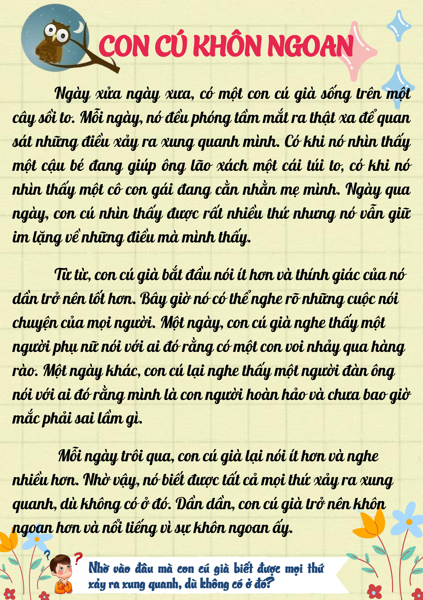

PHIẾU ĐỌC TUẦN 23
=========

1. Giới thiệu
-----
-----------

Bên dưới là phiếu đọc cho tuần 23 môn tiếng Việt, các con hãy cùng nhau luyện đọc nhé: 

|

- **Cùng nghe kể chuyện nào**:

.. raw:: html

    <iframe width="560" height="315" src="https://www.youtube.com/embed/KV-k4BNr-hQ?si=amlcxePBX2BJUv97" title="YouTube video player" frameborder="0" allow="accelerometer; autoplay; clipboard-write; encrypted-media; gyroscope; picture-in-picture; web-share" referrerpolicy="strict-origin-when-cross-origin" allowfullscreen></iframe>
|
